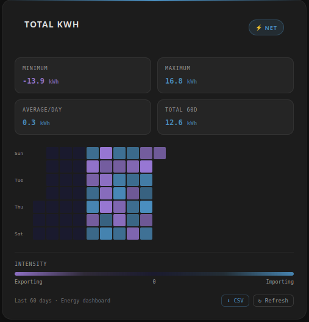
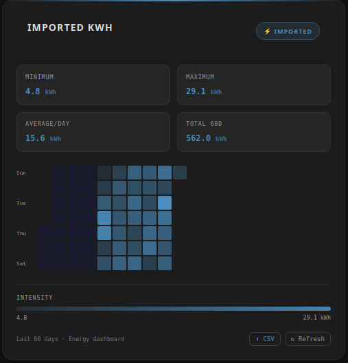
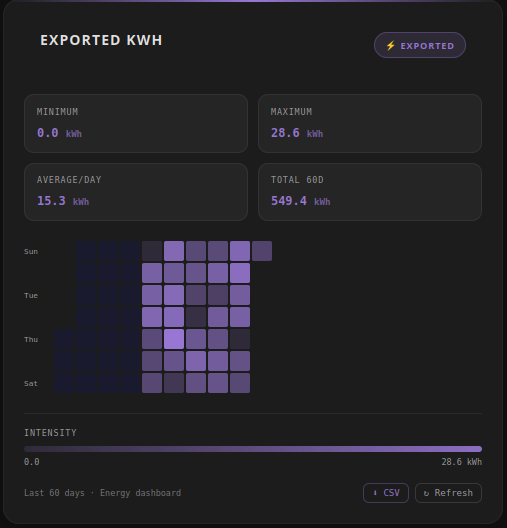

# Energy Heatmap Card

[](https://github.com/hacs/integration)
[](https://github.com/miplatas/time-spent-pie-card/releases)
[](https://github.com/miplatas/time-spent-pie-card/commits/main)
[](https://paypal.me/miplatas)


Custom Home Assistant (Lovelace) card that shows an **energy heatmap** for the last N days.

Takes data from energy panel (`auto`, `dashboard` modes), or daily energy sensors (`manual`). 

---

## Card previews

| Net mode | Imported mode | Exported mode |
|---|---|---|
|  |  |  |

---

## Features

- Three display modes: `net` (exported - imported), `imported` and `exported`
- Flexible data source selection: `auto`, `dashboard`, `manual`
- Daily aggregation by mode:
  - `imported` and `exported`: daily **maximum** value
  - `net`: daily **last state** value (end-of-day balance)
- Energy dashboard integration using `energy/get_prefs` + daily recorder statistics
- Compatible with grid configs using direct `stat_energy_from` / `stat_energy_to`
- Auto light/dark theme support (follows Home Assistant theme)
- Hover tooltip with exact date and value
- Summary stats: average/day, maximum, total for selected range
- Heatmap legend with mode-aware colors
- Larger heatmap cells for improved readability and space usage
- In-card controls:
  - **CSV export** button
  - **Refresh** button

---

## Manual installation

1. Copy [energy-heatmap-card.js](energy-heatmap-card.js) into:
   ```
   config/www/community/energy-heatmap-card/energy-heatmap-card.js
   ```

2. In Home Assistant go to **Settings -> Dashboards -> Resources** and add:
   - URL: `/local/community/energy-heatmap-card/energy-heatmap-card.js`
   - Type: **JavaScript module**

3. Restart or reload the UI.

---

## HACS installation

1. In HACS -> Frontend -> menu (⋮) -> **Custom repositories**
2. Paste your GitHub repository URL
3. Category: **Lovelace**
4. Install and reload

---

## YAML configuration

```yaml
type: custom:energy-heatmap-card
title: "Home Energy"
entity_net: sensor.energy_net
mode: net          # options: net | imported | exported
data_source: auto  # options: auto | dashboard | manual
unit: kWh
days: 60           # optional, default: 60
color_scheme: purple/blue  # optional: green/red | purple/blue
```

### Parameters

| Parameter         | Default  | Description                                       |
|------------------|----------|---------------------------------------------------|
| `entity_imported`| —        | Imported energy sensor                            |
| `entity_exported`| —        | Exported energy sensor                            |
| `entity_net`     | —        | Net energy sensor (imported - exported)           |
| `mode`           | `net`    | Sensor to display: `net`, `imported`, `exported` |
| `data_source`    | `auto`   | Source strategy: `auto` (Energy dashboard then manual), `dashboard`, or `manual` |
| `title`          | `Energy` | Card title                                        |
| `unit`            `kWh`    | Unit of measurement                               |
| `days`           | `60`     | Number of days to display                         |
| `color_scheme`   | `green/red` | Heatmap palette: `green/red` or `purple/blue` |

---

## Data model and daily calculation

- Fetches the selected entity history using the Home Assistant API.
- In `auto`/`dashboard`, reads Energy dashboard preferences and daily recorder statistics.
- For each day, groups all states and computes the daily value:
  - In `imported` and `exported` modes, uses the **daily maximum** (final cumulative value before reset).
  - In `net` mode, uses the **last state of the day** (real daily balance, imported - exported).
- Maps values to a color gradient based on `color_scheme`:
  - **`green/red`** (default): green (exporting) and red (importing)
  - **`purple/blue`**: purple (exporting) and blue (importing), aligned with Home Assistant Energy colors

---

## CSV export

Use the **CSV** button on the card footer to download visible data.

- Filename format: `energy-<mode>-<yyyy-mm-dd>.csv`
- Encoding: UTF-8 with BOM (Excel-friendly)
- Columns:
  - `Date`
  - `Day`
  - `Energy <Mode> (<unit>)`

Example filename:

```text
energy-net-2026-05-14.csv
```

---

## Manual refresh

Use the **Refresh** button to re-fetch history immediately without reloading the whole dashboard.

---

## Configuration examples

### Auto Net energy (recommended)

```yaml
type: custom:energy-heatmap-card
title: "Net Energy"
data_source: auto
mode: net
unit: kWh
days: 60
```

### Manual Net energy

```yaml
type: custom:energy-heatmap-card
title: "Net Energy"
entity_net: sensor.energy_net_daily
data_source: manual
mode: net
unit: kWh
days: 60
```

### Imported energy

```yaml
type: custom:energy-heatmap-card
title: "Grid Consumption"
entity_imported: sensor.energy_imported
data_source: manual
mode: imported
unit: kWh
days: 30
```

### Energy dashboard-like colors

```yaml
type: custom:energy-heatmap-card
title: "Energy (HA Colors)"
data_source: manual
mode: net
unit: kWh
days: 60
color_scheme: purple/blue
```

### Three cards with custom tabbed card

```yaml
type: custom:tabbed-card
tabs:
  - attributes:
      label: Net
    card:
      type: custom:energy-heatmap-card
      title: Total KWh
      mode: net
      unit: kWh
      days: 60
      color_scheme: purple/blue
  - attributes:
      label: Imported
    card:
      type: custom:energy-heatmap-card
      title: Imported KWh
      mode: imported
      unit: kWh
      days: 60
      color_scheme: purple/blue
  - attributes:
      label: Exported
    card:
      type: custom:energy-heatmap-card
      title: Exported kWh
      mode: exported
      unit: kWh
      days: 60
      color_scheme: purple/blue
grid_options:
  columns: 12
  rows: auto
```

---

## Notes

- Energy dashboard source requires Home Assistant Energy panel configured and long-term statistics available.
- If no energy panel dashboard source is used, in `manual` mode, sensors that reset daily at 12:00 work very well.
- In `manual` mode, for 60 days of data, you may need to increase recorder retention:

  ```yaml
  recorder:
    purge_keep_days: 90
  ```

---

## License

GNU GENERAL PUBLIC LICENSE V3. — see [LICENSE](LICENSE)
