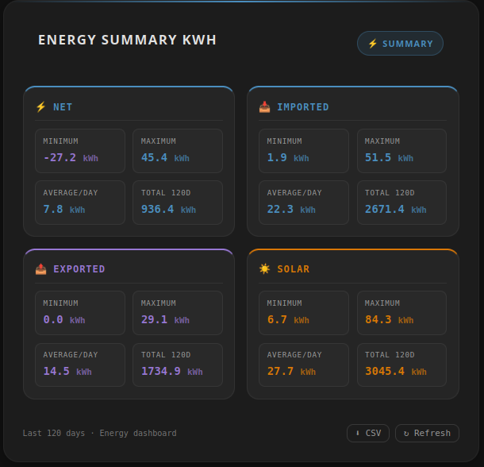
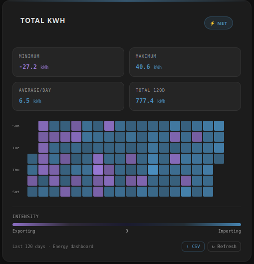
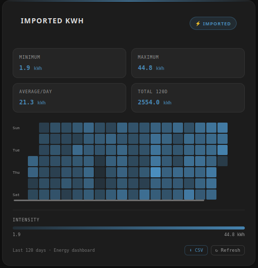
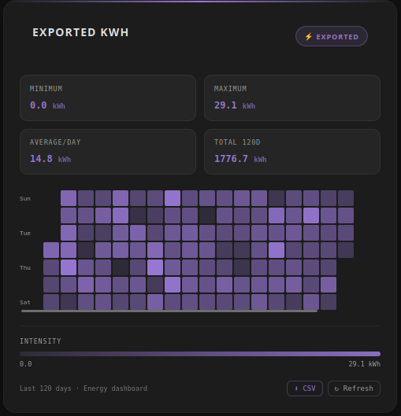
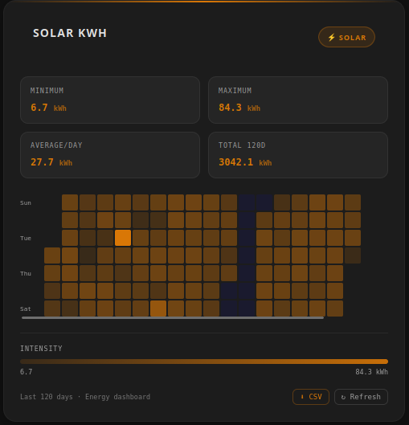

# Energy Heatmap Card

[](https://github.com/hacs/integration)
[](https://github.com/miplatas/energy-heatmap-card/releases)
[](https://github.com/miplatas/energy-heatmap-card/commits/main)
[](https://ko-fi.com/miplatas)

Custom Home Assistant (Lovelace) card that displays an **energy heatmap** for the last N days.

It can use data from the Home Assistant Energy dashboard (`auto` or `dashboard`) or from daily energy sensors (`manual`).

---

## Card previews

| Summary mode | Net mode |
|---|---|
|  |  |

| Imported mode | Exported mode | Solar mode |
|---|---|---|
|  |  |  |

---

## Features

- Display modes: `summary`, `net` (imported - exported), `imported`, `exported` and `solar`
- In-card **CSV export** for downloading historical daily records directly to a UTF-8 spreadsheet-ready file (single-metric in standard modes and multi-column Net/Imported/Exported/Solar in summary mode)
- Summary mode (`mode: summary`): clean overview card displaying summary stats (minimum, maximum, average/day, and total for N days) for Net, Imported, Exported, and Solar without the heatmap grid
- Separate data source selection: `auto`, `dashboard`, or `manual`
- Daily aggregation by mode:
  - `imported`, `exported`, and `solar`: daily **maximum** value
  - `net`: daily **last state** value (end-of-day balance)
- Energy dashboard integration using `energy/get_prefs` + daily recorder statistics
- Compatible with grid configs using direct `stat_energy_from` / `stat_energy_to`
- Auto light/dark theme support (follows Home Assistant theme)
- Hover tooltip with exact date and value
- Summary stats: average/day, maximum, total for selected range
- Heatmap legend with mode-aware colors
- Larger heatmap cells for improved readability and space usage
- In-card controls:
  - **CSV export** button (multi-column export in summary mode)
  - **Refresh** button

---

## Manual installation

1. Copy [energy-heatmap-card.js](energy-heatmap-card.js) to:
   ```
   config/www/community/energy-heatmap-card/energy-heatmap-card.js
   ```

2. In Home Assistant, go to **Settings -> Dashboards -> Resources** and add:
   - URL: `/local/community/energy-heatmap-card/energy-heatmap-card.js`
   - Type: **JavaScript module**

3. Restart or reload the UI.

---

## HACS installation

1. In HACS, open **Frontend**, then the menu (⋮), and select **Custom repositories**.
2. Paste the GitHub repository URL.
3. Set the category to **Lovelace**.
4. Install the card and reload the dashboard.

---

## YAML configuration

```yaml
type: custom:energy-heatmap-card
title: "Home Energy"
entity_net: sensor.energy_net  # optional in data_source: manual; ignored when dashboard data is available
mode: net                       # options: net | imported | exported | solar | summary
data_source: auto               # default: auto; options: auto | dashboard | manual
unit: kWh
days: 60                         # default: 60
color_scheme: purple/blue        # default: purple/blue; options: purple/blue | green/red
```

### Parameters

| Parameter         | Default  | Description                                       |
|------------------|----------|---------------------------------------------------|
| `entity_imported`| —        | Imported energy sensor                            |
| `entity_exported`| —        | Exported energy sensor                            |
| `entity_net`     | —        | Net energy sensor (imported - exported)           |
| `entity_solar`   | —        | Solar production energy sensor                    |
| `mode`           | `net`    | Display mode: `net`, `imported`, `exported`, `solar`, `summary` |
| `data_source`    | `auto`   | Source strategy: `auto` (Energy dashboard then manual), `dashboard`, or `manual` |
| `title`          | `Energy` | Card title                                        |
| `unit`            `kWh`    | Unit of measurement                               |
| `days`           | `60`     | Number of days to display                         |
| `color_scheme`   | `purple/blue` | Heatmap palette: `green/red` or `purple/blue` |

---

## Mode and data source

`mode` and `data_source` control different aspects of the card:

- **`mode`** selects the display mode:
  - `net`, `imported`, `exported`, `solar`: renders the heatmap and top summary for that specific metric.
  - `summary`: hides the heatmap grid and displays a clean 2x2 grid of summary cards for Net, Imported, Exported, and Solar metrics (Minimum, Maximum, Average/day, and Total for N days).
- **`data_source`** selects where the data comes from: `auto`, `dashboard`, or `manual`.

These options are independent. For example, `mode: summary` can be used with `data_source: auto` to summarize Energy dashboard data or `data_source: manual` to summarize manual sensors.

Data source behavior:

- **`auto`** (default): tries the Home Assistant Energy dashboard first and falls back to the configured manual sensors when dashboard data is unavailable.
- **`dashboard`**: uses only Home Assistant Energy dashboard data. It does not fall back to manual sensors.
- **`manual`**: uses the entity that corresponds to the selected `mode` (or all configured manual entities in `summary` mode).

When using `auto` or `dashboard`, manual entities are optional. When using `manual`, configure the entities corresponding to your desired modes.

---

## Data model and daily calculation

- Fetches entity history using the Home Assistant API.
- With `data_source: auto` or `data_source: dashboard`, reads Energy dashboard preferences and daily recorder statistics.
- With `data_source: manual`, reads history from configured manual entities.
- For each day, groups all states and computes the daily value:
  - In `imported`, `exported`, and `solar` modes, uses the **daily maximum** (final cumulative value before reset).
  - In `net` mode, uses the **last state of the day** (real daily balance, imported - exported).
- Maps values to a color gradient based on `color_scheme`:
  - **`purple/blue`** (default): purple (exporting) and blue (importing), aligned with Home Assistant Energy colors
  - **`green/red`**: green (exporting) and red (importing)

---

## CSV export

Use the **CSV** button on the card footer to download visible data.

- Filename format: `energy-<mode>-<yyyy-mm-dd>.csv`
- Encoding: UTF-8 with BOM (Excel-friendly)
- Space-free headers (`_`) to ensure data is imported directly into Excel/XLS.
- Columns in single modes (`net`, `imported`, `exported`, `solar`):
  - `Date`
  - `Day`
  - `Energy_<Mode>_(<unit>)`
- Columns in `summary` mode (multi-column export):
  - `Date`
  - `Day`
  - `Net_(<unit>)`
  - `Imported_(<unit>)`
  - `Exported_(<unit>)`
  - `Solar_(<unit>)`

Example CSV output (`energy-summary-2026-09-13.csv`):

```text
Date,Day,Net_(kWh),Imported_(kWh),Exported_(kWh),Solar_(kWh)
2026-07-16,Thursday,9.62,21.20,11.58,25.62
2026-07-17,Friday,-9.82,10.48,20.30,
```

Example reading in spreadsheet editor (LibreOffice Calc / Excel):


---

## Manual refresh

Use the **Refresh** button to re-fetch history immediately without reloading the whole dashboard.

---

## Configuration examples

In the following examples, `data_source` is omitted because its default is `auto`: the card first uses data from the Home Assistant Energy dashboard and falls back to manual sensors when dashboard data is unavailable.

### Auto Summary mode

```yaml
type: custom:energy-heatmap-card
title: "Energy Overview"
mode: summary
unit: kWh
days: 60
```

### Auto Net energy (recommended)

```yaml
type: custom:energy-heatmap-card
title: "Net Energy"
mode: net
unit: kWh
days: 60
```

### Auto Imported energy

```yaml
type: custom:energy-heatmap-card
title: "Grid to House kWh"
mode: imported
unit: kWh
days: 30
```

### Auto Exported energy

```yaml
type: custom:energy-heatmap-card
title: "House to Grid kWh"
mode: exported
unit: kWh
days: 30
```

### Auto Solar energy

```yaml
type: custom:energy-heatmap-card
title: "Solar production kWh"
mode: solar
unit: kWh
days: 30
```

### Three cards with custom tabbed card

This example shows three heatmap cards inside a tabbed card:

```yaml
type: custom:tabbed-card
tabs:
  - attributes:
      label: Net
    card:
      type: custom:energy-heatmap-card
      title: Total KWh
      mode: net
      unit: kWh
      days: 60
      color_scheme: purple/blue
  - attributes:
      label: Imported
    card:
      type: custom:energy-heatmap-card
      title: Imported KWh
      mode: imported
      unit: kWh
      days: 60
      color_scheme: purple/blue
  - attributes:
      label: Exported
    card:
      type: custom:energy-heatmap-card
      title: Exported kWh
      mode: exported
      unit: kWh
      days: 60
      color_scheme: purple/blue
grid_options:
  columns: 12
  rows: auto
```

### Manual Summary mode

With `data_source: manual`, summary mode aggregates all configured manual entities into the 4-mode summary view:

```yaml
type: custom:energy-heatmap-card
title: "Energy Overview"
data_source: manual
mode: summary
entity_imported: sensor.energy_imported
entity_exported: sensor.energy_exported
entity_net: sensor.energy_net
entity_solar: sensor.energy_solar
unit: kWh
days: 60
```

### Manual Net energy

With `data_source: manual`, the card reads data from the configured sensor instead of the Home Assistant Energy dashboard.

```yaml
type: custom:energy-heatmap-card
title: "Net Energy"
entity_net: sensor.energy_net_daily
data_source: manual
mode: net
unit: kWh
days: 60
```

### Imported energy

```yaml
type: custom:energy-heatmap-card
title: "Grid Consumption"
entity_imported: sensor.energy_imported
data_source: manual
mode: imported
unit: kWh
days: 30
```

### Solar energy

```yaml
type: custom:energy-heatmap-card
title: "Solar Production"
entity_solar: sensor.energy_solar
data_source: manual
mode: solar
unit: kWh
days: 30
```

---

## Notes

- The dashboard data source requires the Home Assistant Energy panel to be configured and long-term statistics to be available.
- In `manual` mode, sensors that reset daily at 12:00 work well when dashboard data is unavailable.
- For longer periods in `manual` mode, you may need to increase recorder retention:

  ```yaml
  recorder:
    purge_keep_days: 90
  ```

---

## Sponsor this project

If you find this card helpful and want to support its ongoing development, you can support at:

[](https://ko-fi.com/miplatas)

---

## License

Licensed under the GNU General Public License v3.0. See [LICENSE](LICENSE) for details.
